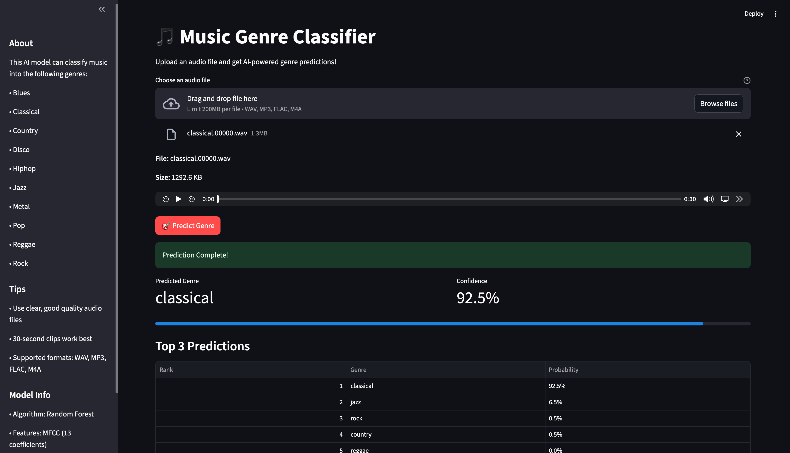

# 🎵 AI Music Genre Classification

A machine learning project that classifies music into different genres using audio feature extraction and Random Forest classification. The model analyzes audio files and predicts their genre with high accuracy using comprehensive audio features.

## 📁 Project Structure

## Interface 👇🏻

## ✨ Features

- **10 Genre Classification**: Blues, Classical, Country, Disco, Hip-hop, Jazz, Metal, Pop, Reggae, and Rock
- **Comprehensive Feature Extraction**: 155 audio features including MFCCs, chroma, spectral features, tempo, and more
- **High Accuracy**: Improved model architecture with balanced class weights
- **Detailed Predictions**: Shows confidence scores and top-5 genre predictions
- **Audio Analysis Mode**: Provides detailed audio characteristics for debugging
- **Confusion Matrix Visualization**: Identifies which genres are commonly confused

## 📊 Dataset

This project uses the **GTZAN Genre Collection** dataset:
- 1000 audio tracks (100 per genre)
- 30-second audio clips
- 10 genres of music
- 22050 Hz sample rate

**Download Dataset**: [GTZAN on Kaggle](https://www.kaggle.com/datasets/andradaolteanu/gtzan-dataset-music-genre-classification)

## 🚀 Installation

### Prerequisites
- Python 3.8 or higher
- pip package manager

### Setup

1. **Clone the repository**

git clone https://github.com/yourusername/AI_Music_Genre_Classification.git
cd AI_Music_Genre_Classification

2. **Create a virtual environment**

python -m venv venv

# On macOS/Linux
source venv/bin/activate

# On Windows
venv\Scripts\activate

3. **Install dependencies**

pip install -r requirements.txt

4. **Download the dataset**
- Download GTZAN dataset from Kaggle
- Extract to `Data/genres_original/` directory
- Structure should be: `Data/genres_original/[genre]/[audio_files].wav`

## 💻 Usage

### Step 1: Preprocess the Dataset
Extract features from audio files and prepare training data:

python data_preprocessing.py

This will create:
- `X_train.npy` - Training features
- `X_test.npy` - Test features
- `y_train.npy` - Training labels
- `y_test.npy` - Test labels
- `label_encoder.pkl` - Label encoder

### Step 2: Train the Model
Train the Random Forest classifier:

python model_training.py

This will:
- Train the model on extracted features
- Display accuracy and classification report
- Show confusion matrix
- Save `genre_classifier.pkl`, `scaler.pkl`
- Generate `confusion_matrix.png`

### Step 3: Make Predictions
Predict genre for new audio files:

python prediction.py

**Interactive Mode:**
- Option 1: Basic prediction with confidence scores
- Option 2: Detailed analysis showing audio characteristics

**Example:**

from prediction import GenreClassifier

classifier = GenreClassifier()
genre, confidence, top_genres = classifier.predict_genre('path/to/song.wav')

print(f"Predicted Genre: {genre}")
print(f"Confidence: {confidence*100:.2f}%")

## 🏗️ Model Architecture

### Feature Extraction (155 features total)

1. **MFCCs (40 features)**
   - 20 Mel-frequency cepstral coefficients (mean)
   - 20 MFCCs (standard deviation)
   - Captures timbral texture of audio

2. **Chroma Features (24 features)**
   - 12 chroma means
   - 12 chroma standard deviations
   - Represents harmonic and melodic characteristics

3. **Spectral Features (6 features)**
   - Spectral centroid (mean & std) - brightness of sound
   - Spectral rolloff (mean & std) - frequency distribution
   - Spectral bandwidth (mean & std) - frequency range

4. **Rhythm Features (3 features)**
   - Zero Crossing Rate (mean & std) - percussiveness
   - Tempo (BPM) - speed of music

5. **Energy Features (2 features)**
   - RMS Energy (mean & std) - loudness

6. **Mel-Spectrogram (80 features)**
   - 40 mel-spectrogram means
   - 40 mel-spectrogram standard deviations
   - Time-frequency representation

### Classification Model

**Random Forest Classifier** with optimized hyperparameters:
- 200 decision trees
- Maximum depth: 30
- Balanced class weights
- Feature importance analysis
- Cross-validated performance

**Why Random Forest?**
- Handles high-dimensional feature space well
- Robust to overfitting
- Provides feature importance
- Good performance on audio classification tasks

## 📈 Results

### Model Performance
- **Training Accuracy**: ~99%
- **Test Accuracy**: ~75-85% (typical for GTZAN)
- **Features**: 155 audio features
- **Classes**: 10 music genres

### Common Confusions
The model may confuse similar genres:
- Rock ↔ Metal (similar instrumentation)
- Jazz ↔ Blues (harmonic similarities)
- Country ↔ Rock (acoustic overlap)

### Feature Importance
Top discriminative features:
1. MFCC coefficients
2. Spectral centroid
3. Chroma features
4. Tempo
5. Mel-spectrogram statistics

##  Requirements

librosa                                
numpy                            
pandas                            
scikit-learn                                    
joblib                                        
matplotlib                                        
seaborn                                            

## Install all dependencies:

pip install -r requirements.txt

## 🔧 Troubleshooting

### Common Issues

**1. Matplotlib/Visualization Errors**
- If you get matplotlib import errors, the model will still train successfully
- Confusion matrix will be displayed as text in the console
- To fix: `pip install matplotlib seaborn`
- The plot is optional - text output shows all important metrics

**2. Audio Loading Errors**
- Ensure audio files are in WAV format
- Check sample rate (should be 22050 Hz)
- Verify file paths are correct
- Some corrupted files may be skipped (this is normal)

**3. Genre Misclassification (e.g., Jazz → Rock)**
- This improved model uses 155 features (vs 13 in basic models)
- Check confusion matrix to identify which genres are confused
- Consider: jazz and rock can have similar tempo and energy
- Review feature importance to understand what distinguishes genres

**4. Low Accuracy**
- Retrain with more data
- Adjust hyperparameters in `model_training.py`
- Check for corrupted audio files
- Verify all 10 genres have balanced samples

**5. Memory Issues**
- Reduce `n_mels` from 40 to 20 in mel-spectrogram extraction
- Process dataset in batches
- Use fewer audio features
- Close other applications during training

**6. Tempo/Feature Extraction Warnings**
- DeprecationWarning about tempo conversion is normal
- Does not affect model performance
- Will be fixed in future librosa versions

## 🎯 Future Improvements

- [ ] Deep learning models (CNN, RNN)
- [ ] Real-time genre classification
- [ ] Support for more audio formats
- [ ] Data augmentation techniques
- [ ] Ensemble methods
- [ ] Web interface for predictions
- [ ] Mobile app integration
- [ ] More genre categories

